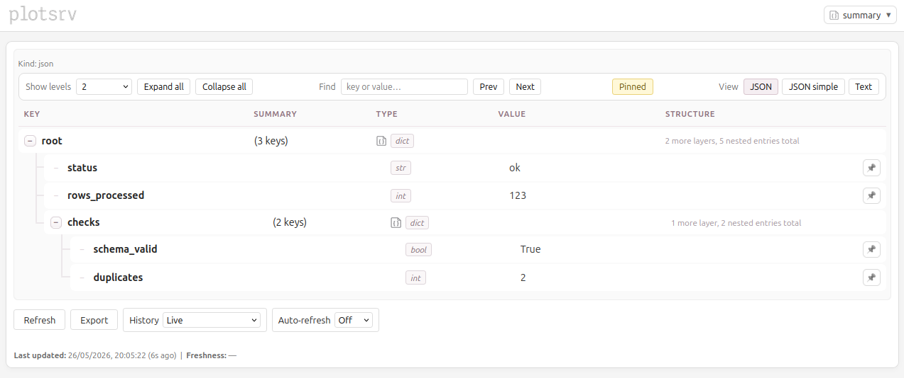

# What is plotsrv?

`plotsrv` is a lightweight observability platform for surfacing live outputs from Python processes through a browser UI.

It gives a Python process somewhere useful to publish:

- tables
- plots
- JSON-like objects
- logs
- markdown
- HTML
- images
- tracebacks
- files on disk

Many useful outputs already exist in memory while a script, job, pipeline, or experiment runs. `plotsrv` makes those objects visible and inspectable with very little extra code.

It can also be used deliberately: publish status objects, validation summaries, generated reports, intermediate results, or ordinary Python objects, and plotsrv will render them with an appropriate viewer.

Those viewers provide useful inspection features where possible, such as search, filtering, expansion, browsing, and history.

In short: `plotsrv` gives Python processes cheap observability.

## A small example

To publish a nested Python dictionary into the UI:

```python
import plotsrv as ps

summary = {
    "status": "ok",
    "rows_processed": 123,
    "checks": {
        "schema_valid": True,
        "duplicates": 2,
    },
}

ps.publish_view(
    summary,
    label="summary",
    launch_server=True,
)
```

Open:

```text
http://127.0.0.1:8000
```

plotsrv will render the object as structured JSON.

<div align="center">
  
</div>

## What it is for

plotsrv is useful when a Python process already produces useful objects such as plots, tables, HTML reports, logs, metrics, or intermediate results, and there is value in exposing those outputs through a lightweight live UI with minimal additional code.

Common cases include:

- checking outputs from an ETL job
- viewing/exploring a DataFrame on a server
- inspecting JSON-like status objects
- publishing plots during experimentation
- watching log files and generated artifacts
- seeing whether a repeated process is fresh or stale
- keeping recent snapshots of outputs

## What it is not

plotsrv is not intended to replace:

- a dashboard framework
- a BI tool
- a public web application framework

## Ways to use it

For quick interactive use, start an attached server from Python:

```python
ps.publish_view(obj, launch_server=True)
```

For scripts, jobs, and pipelines, start plotsrv separately:

```bash
plotsrv run path/to/script_or_project.py
```

Then publish to that running server using `publish_view` or `@view`:

```python
ps.publish_view(
    obj,
    host="127.0.0.1",
    port=8000,
    label="result",
)
```

## Next step

Continue to [Installation](installation.md).
