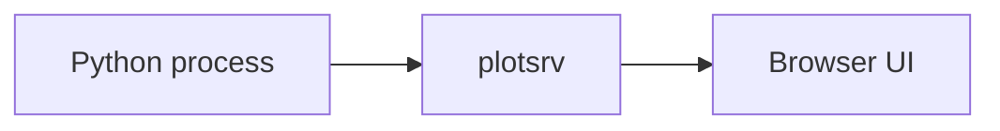

# What is plotsrv?

plotsrv is a lightweight browser UI for observing live outputs from Python processes.

You publish something from Python, and plotsrv shows it in a browser.

That “something” might be:

- a table
- a plot
- a log
- a JSON object
- a markdown report
- an HTML report
- an image
- a traceback
- a generic Python object

!!! note

    plotsrv is not mainly for building dashboards. It is for observing what Python processes are producing while they run.

## The basic idea

A Python process sends data to plotsrv.

plotsrv stores the latest version of that data in memory and renders it in a browser UI.

For example:

```python title="example.py"
import polars as pl
import plotsrv as ps

df = pl.DataFrame({
    "name": ["alpha", "beta", "gamma"],
    "value": [10, 20, 30],
})

ps.refresh_view(df)
```

Open:

```text
http://127.0.0.1:8000
```

You should see the DataFrame as an interactive table.

??? info "What happened?"

    `ps.refresh_view(df)` inspected the object, recognised it as a DataFrame, published it into plotsrv, and started the local browser UI if needed.

    The current object is held in memory by the running plotsrv server.

## Why use it?

plotsrv is useful when you want to see what a Python process is doing without building a dashboard application.

Common examples include:

- monitoring an ETL job
- checking the latest output from a scheduled script
- inspecting logs from a running process
- viewing a table on a headless server
- exploring JSON-like Python objects
- publishing plots during experimentation
- checking the state of an ML or AI inference process
- seeing tracebacks in a browser UI

## How plotsrv is different from a dashboard framework

With a dashboard framework, you usually start by designing an application.

With plotsrv, you usually start by publishing an object:

```python
ps.refresh_view(obj)
```

or by marking a function as a view:

```python
import plotsrv as ps

@ps.view(label="Daily result", section="etl")
def daily_result():
    return {
        "status": "ok",
        "rows": 10000,
        "warnings": 0,
    }
```

plotsrv then chooses a suitable renderer.

That means the first useful version of a plotsrv view can be very small.

## Where plotsrv fits well

plotsrv works well for:

- scripts
- ETL pipelines
- scheduled jobs
- development servers
- exploratory analysis
- headless machines
- SSH workflows
- operational debugging
- lightweight monitoring

It is especially useful when the output is already available in Python, but you want a better way to inspect it than printing to the terminal.

## Where plotsrv may not be the right tool

plotsrv may not be the right tool if you need:

- a polished multi-user dashboard
- a public internet-facing application
- full authentication and user management
- a replacement for Grafana or Prometheus
- a business intelligence platform
- a complex custom frontend

You can still deploy plotsrv carefully, but its core purpose is simple: observe what Python processes are producing.

## The shortest mental model



Your Python code publishes an object. plotsrv renders it. You view it in the browser.
