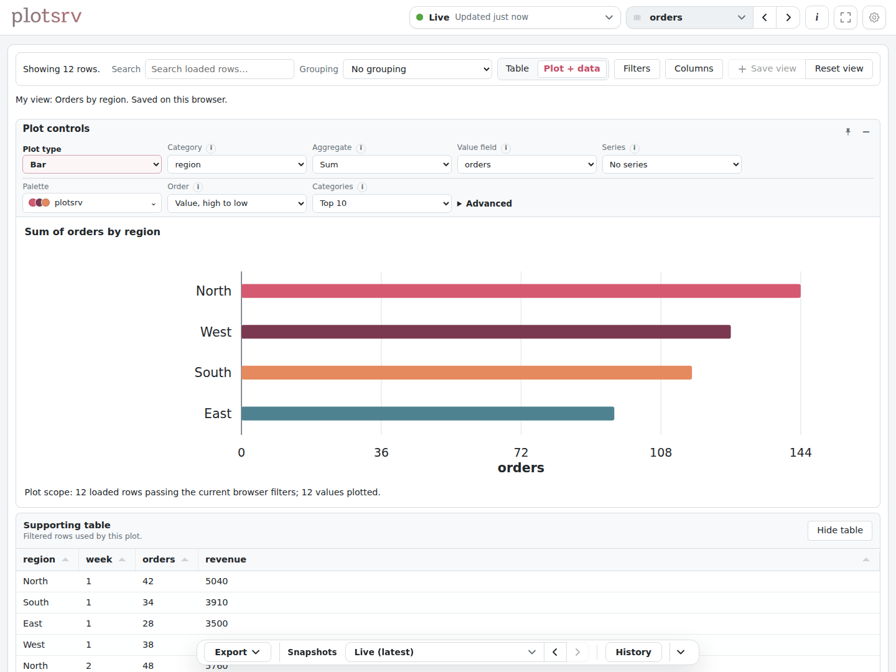
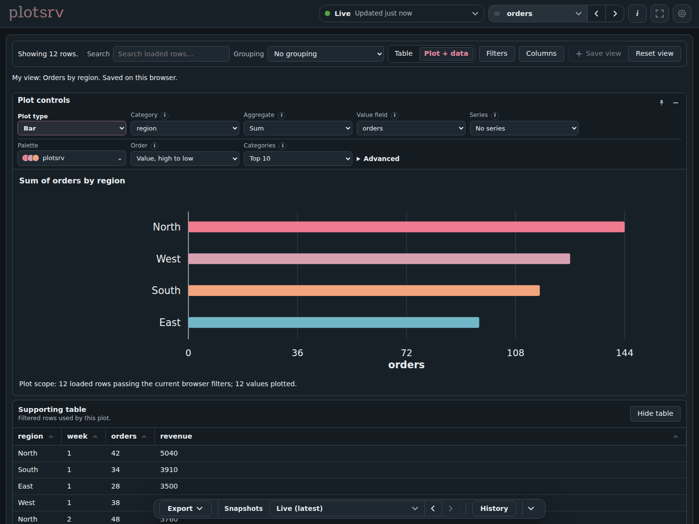

# Explore in the browser

Open **<http://127.0.0.1:8000>** and choose a view from the header. Start with a
table: it gives you search, filters, grouping, columns, and plots without changing
your Python code.

## Find the output you want

Open the view selector and search by name. **Grouped** keeps your sections
together; **A–Z** gives you an alphabetical list. Pin a view you return to often.
**About this view**, when present, explains what the source contains.

The selector’s **My views** tab holds presentations you saved in this browser.
**Suggested views** appears for sources with useful built-in presentations,
including supported logs and observations.

## Narrow a table

1. Search for a value to narrow the visible rows.
2. Use column filters when you need a particular field or range.
3. Group by a column to compare related rows.
4. Hide columns you do not need and reorder the useful ones.

Click column headings to sort. Filters and grouping operate on the rows loaded
in the browser, not an unlimited query against your original DataFrame or file.
Read the row/coverage notice when the source is truncated.

## Plot the rows you are looking at

Switch from **Table** to **Plot + data**, choose the fields, and pick the supported plot
type you need. Use the supporting-data control to see the table beside the plot.
Searches and filters affect the plotted table data too.

If the plot reports too many points or series, narrow the data or choose a simpler
presentation. A browser plot has limits; it is not a replacement for doing a large
aggregation in Python.

Matplotlib and plotnine outputs are different: plotsrv displays their rendered
image. You can fit and inspect it, but cannot change the underlying Python plot
from the table plotting controls.

## Save a useful setup

Change the filters, columns, grouping, or plot, then choose **Save view** beside
**Reset view**. Give it a name such as “Orders by region”. Open it later from
**My views**.

Saving keeps the presentation on this browser. It does not store the data, create
a server-side view, or share a dashboard. Opening a saved view uses the latest
source data, even if you originally saved while looking at a historical version.

After editing a saved view, choose **Update** or **Save as new**. **Reset view**
restores the active saved setup, or the ordinary defaults when no saved view is
active. If fields change, plotsrv can ask you to repair the presentation instead
of silently removing a filter. Review the result before saving it again.

Anyone using the same browser profile can see its saved names, captions, and
filters. Clearing site storage removes them. See [saved-view limits](../reference/supported-outputs-and-files.md#saved-presentations)
for compatibility and storage details.

<figure class="plotsrv-screenshot" markdown="1">

[{ loading="lazy" width="1440" height="1080" }](../assets/images/screenshots/table-light.png){ .plotsrv-shot-light }

[{ loading="lazy" width="1440" height="1080" }](../assets/images/screenshots/table-dark.png){ .plotsrv-shot-dark }

<figcaption>A bar plot and its supporting rows, saved as “Orders by region”. Click to enlarge.</figcaption>
</figure>

## Read without chasing updates

The normal view can update as new data arrives. When you filter or inspect a plot,
the browser can hold an update so it does not disturb your work. Use the update
control to apply pending data. This holds the browser presentation, not the
producer or server.

For streams, **Pause** freezes the displayed window while collection continues.
Returning to **Live** shows the current retained window; older records may have
expired. See [Follow logs and streams](follow-logs-and-streams.md).

## Look at an earlier version

When storage is enabled, use the bottom history selector and older/newer controls.
Historical mode is labelled. Return to **Live** to see current output again.
The history timeline helps find a stored version from another time. Step between
versions to compare their outputs. See [Keep history](keep-history.md).

Saving a table presentation and keeping a historical version are separate things.

## Export what you found

Use **Export** in the bottom bar to download table rows as CSV or a browser plot
as SVG or PNG. Read the scope in the menu: filtered rows, a retained stream window,
and a complete published table can contain different data. A remote file preview
does not give the browser access to the publisher's original file.

## Make room

Use **Expand view** to hide the surrounding controls. Reveal them when you need
to switch sources or change the presentation, then exit expanded mode to return.
Choose a light or dark theme in browser settings. These preferences belong to
this browser; changing the dashboard’s shared title or logo uses the
[configuration tools](configure-plotsrv.md).
