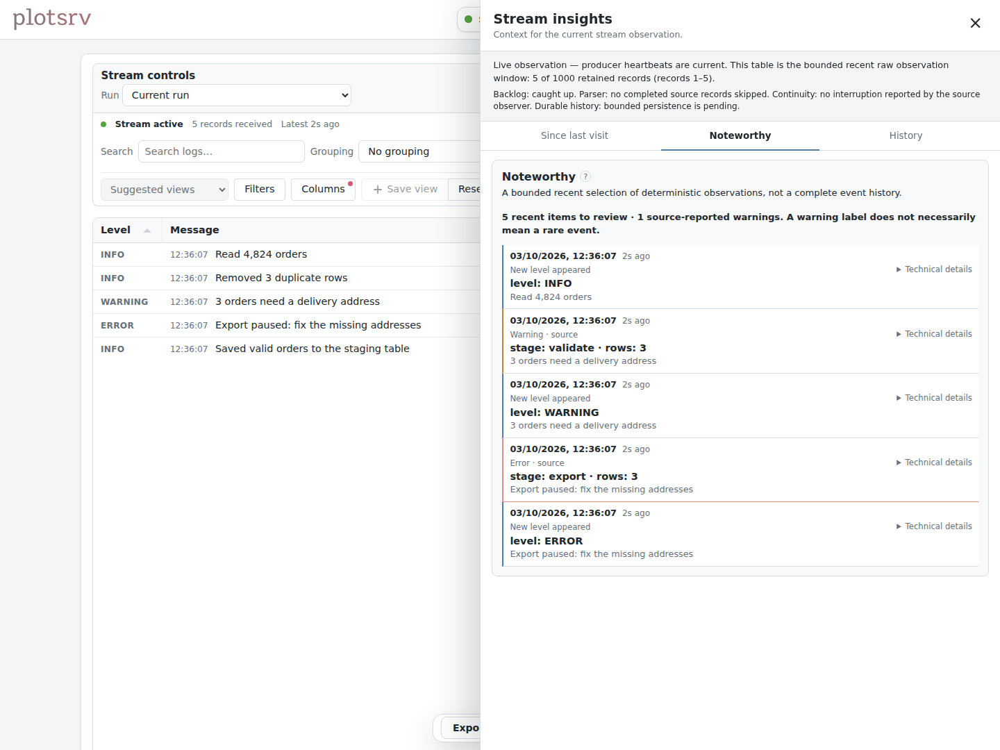
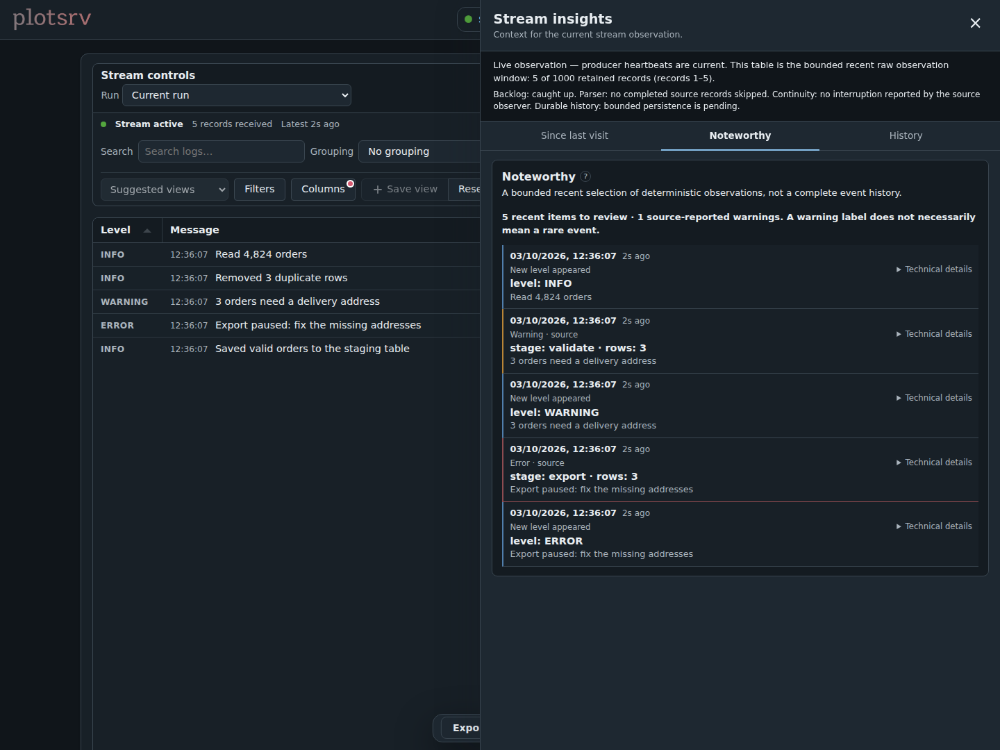

# Follow logs and streams

Have a log file? Start here:

```bash
plotsrv watch ./logs/job.log --tail
```

That shows a changing text preview. If you want records you can filter, plot, and
browse by run, use `stream_view` with a running server.

## Follow new records

Start the server:

```bash
plotsrv serve
```

In a Python REPL beside an existing log file:

```python
import plotsrv as ps

stream = ps.stream_view(
    source="./logs/job.log",
    format="text",
    label="job log",
    port=8000,
)
```

Open **<http://127.0.0.1:8000>**. Leave this Python session running while your job
writes to the log. When finished, call `stream.stop(timeout=2)`.

An existing file starts at its current end. The stream shows records written
after registration; it does not import old lines. A missing file can appear later,
when reading begins from its start.

## Try a JSONL stream

This complete script creates a file, registers the stream, and writes new records:

```python
import json
from pathlib import Path
import plotsrv as ps

source = Path("events.jsonl")
source.touch(exist_ok=True)
stream = ps.stream_view(source=source, label="orders", section="logs", port=8000)
try:
    with source.open("a", encoding="utf-8") as output:
        for sequence in range(5):
            output.write(json.dumps({"sequence": sequence, "rows": sequence * 12}) + "\n")
            output.flush()
finally:
    stream.stop(timeout=2)
```

JSONL is the default format. Each record must be a complete JSON object on one
line. Malformed or oversized records are reported rather than making the stream
an unbounded log buffer. Keep the original file when you need a complete archive.

## Follow application and HTTP logs

For mixed Uvicorn access/application output:

```python
stream = ps.stream_view(
    source="./logs/access.log",
    format="uvicorn",
    label="web requests",
    port=8000,
)
```

plotsrv recognises supported access records and frames text and tracebacks into
records. It does not replace your logger or intercept stdout. `format="auto"`
uses JSONL for `.jsonl`/`.ndjson` and the conservative Uvicorn adapter otherwise.

Recognised HTTP or Python log records can offer **Suggested views** for useful
counts, status groups, or activity. Start with a suggestion, adjust its table or
plot, and save the result in **My views**. Suggestions describe retained evidence,
not all traffic your application has ever seen.

Paths and messages can contain sensitive data. The adapter removes supported URL
query/fragment details, but this is not general-purpose log redaction. Review the
[format and privacy rules](../reference/streams.md) before publishing private logs.

## Pause to inspect a record

Use **Pause** to hold the browser’s current display. The producer keeps sending
records and the server keeps its bounded window. **Live** returns to that window;
it cannot recover records that have already expired.

**Since last visit** compares retained evidence with this browser’s earlier visit
when the session is compatible. **Noteworthy** brings selected events to the front.
Neither is a complete error log or a promise that every event was retained.

<figure class="plotsrv-screenshot" markdown="1">

[{ loading="lazy" width="1440" height="1080" }](../assets/images/screenshots/stream-light.png){ .plotsrv-shot-light }

[{ loading="lazy" width="1440" height="1080" }](../assets/images/screenshots/stream-dark.png){ .plotsrv-shot-dark }

<figcaption>New log records, with retained warnings and errors in Noteworthy. Click to enlarge.</figcaption>
</figure>

## Return to an earlier run

Each stream registration has a session. The browser can show retained previous
sessions, and [storage](keep-history.md) can preserve compact session history
across a server restart. Raw records are not stored on disk by default.

A live heartbeat says the observer is connected; it does not prove that the job
is doing useful work. A stopped or disconnected stream is labelled separately.
If delivery seems stuck, inspect the local observer:

```python
print(stream.health)
```

For remote destinations, see [Run plotsrv on another machine](run-on-another-machine.md).
For exact formats, continuity, retention, and limits, see
[Streams and log formats](../reference/streams.md).
