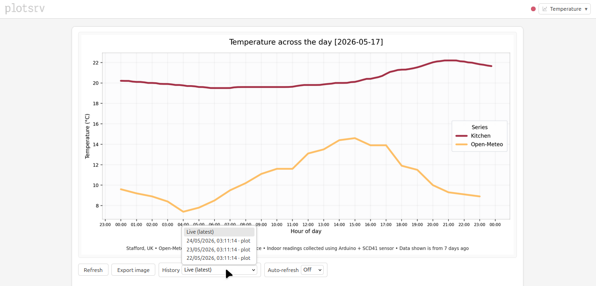

# plotsrv

**Lightweight observability for Python processes.**

`plotsrv` turns Python objects into live browser views with minimal code.

Tables, plots, JSON, HTML, logs, images, tracebacks, and files can be surfaced through a browser UI designed for scripts, pipelines, experiments, batch jobs, and long-running processes.

> **Live demo:** https://demo.plotsrv.com  
> See a deployed example showing real sensor data.

{ width="900" }

Wrap a content-producing function with `@ps.view(...)`, or publish an object directly with `ps.publish_view(...)`.

Your code continues to run normally, while plotsrv publishes the returned objects into a browser UI. Labels and sections organise related outputs into a connected interface, giving scripts and pipelines lightweight observability with historical snapshots, freshness indicators, rich renderers, and more.

## Who is it for?

plotsrv is for Python users who want more visibility into scripts, pipelines, experiments, and batch processes without building dashboards or manually producing lots of on-disk artifacts.

It is useful when outputs are currently hidden in terminal logs, scattered across files, or difficult to inspect visually. For example:

- checking pipeline outputs while a job runs
- surfacing validation summaries, plots, tables, and status objects
- going beyond a text log file buried on disk
- inspecting data visually from a headless or remote server
- creating a lightweight observability surface for internal scripts and jobs

plotsrv is not intended to replace heavier observability or experiment-tracking platforms such as Grafana, Prometheus, MLflow, or Weights & Biases.

Its strength is that it can directly render a wide range of ordinary Python objects with very little setup, making it useful in the space between `print()` statements, log files, notebooks, dashboards, and full observability stacks.

## More than a viewer

Beyond simply rendering outputs, it can:

- organise related views into sections
- track freshness and staleness
- watch files on disk
- retain historical snapshots
- compare current and previous outputs
- restore persisted views after restart
- provide rich renderers for tables, plots, HTML, JSON, tracebacks, and more

## Where to start

### New to plotsrv?

- **[Quick Start](get-started/quick-start.md)** — publish a first view
- **[What is plotsrv?](get-started/what-is-plotsrv.md)** — A brief overview of plotsrv and it's features.

### Exploring features

- **[Renderers](guides/renderers.md)** — tables, plots, JSON, HTML, markdown, images, tracebacks, and files
- **[Storage & History](guides/storage-and-history.md)** — snapshots and historical browsing
- **[Freshness](guides/freshness.md)** — monitor when outputs become stale
- **[Configuration](get-started/configuration-basics.md)** — control plotsrv behaviour

## Is it reliable?

plotsrv is developed with automated testing as a core part of the project.

Coverage includes:

- unit and integration testing
- end-to-end tests
- benchmark tests
- automated example pipelines using a dedicated [examples repository](https://github.com/anees-hill/plotsrv-examples)

!!! note

    More information is available on the **[Testing & Benchmarks](about/testing-and-benchmarks.md)** page.

## Next step

Continue to **[Quick Start](get-started/quick-start.md)**.
