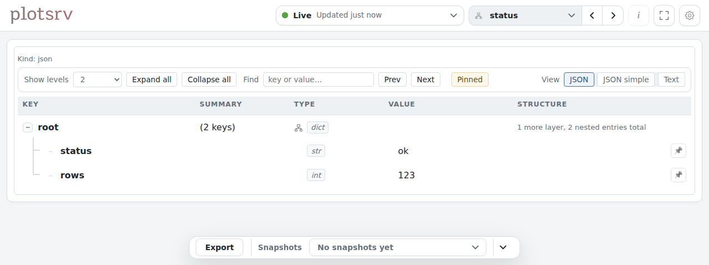
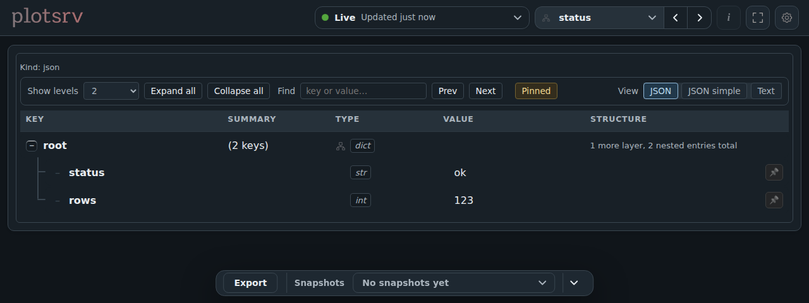

# plotsrv

Got a Python object you’d like to see in a browser?

Try this in a Python REPL or notebook:

```python
import plotsrv as ps

ps.publish_view(
    {"status": "ok", "rows": 123},
    label="status",
    launch_server=True,
)
```

Open **<http://127.0.0.1:8000>**. Keep the Python session running while you look around.

That’s the basic idea. Publish a DataFrame to get a table, a Matplotlib figure to
see a plot, or a dictionary to inspect its contents. You can also show Markdown,
images, HTML reports, and text.

<figure class="plotsrv-screenshot" markdown="1">

[{ loading="lazy" width="1280" height="480" }](assets/images/screenshots/status-light.png){ .plotsrv-shot-light }

[{ loading="lazy" width="1280" height="480" }](assets/images/screenshots/status-dark.png){ .plotsrv-shot-dark }

<figcaption>A dictionary, shown as a tree. Click the image to enlarge it.</figcaption>
</figure>

[Install and try it →](get-started/quick-start.md)

## Already have a file?

```bash
plotsrv watch ./logs/job.log --tail
```

Open the same address. The view updates when the file changes.
You can [watch a directory](get-started/watch-files.md#watch-a-directory) too.

## Put it in a job

Give a function a view, run your job normally, and inspect the result while it
runs. The server can stay up between runs, keep previous versions, and show
when an expected update is late.

[Use plotsrv in a project →](get-started/use-in-a-project.md)

plotsrv is an open-source project, developed primarily by one developer. It is
for looking at useful outputs without building a dashboard around them.

[Try the live demo](https://demo.plotsrv.com) ·
[Browse an ETL example](examples/etl-pipeline.md) ·
[Contribute](development/contributing.md)
